# Class Diagram

```mermaid
classDiagram
    direction TB

    %% ─────────────────────────────────────────
    %% APPLICATION
    %% ─────────────────────────────────────────

    class ArtworksManagerApp {
        <<Application>>
        +database : ArtworkDatabase
        +repository : ArtworkRepository
        +preferences : AppPreferences
    }

    %% ─────────────────────────────────────────
    %% DATA LAYER
    %% ─────────────────────────────────────────

    class Artwork {
        <<Entity>>
        +id : Long
        +title : String
        +artist : String
        +year : Int
        +type : String
        +medium : String
        +heightCm : Float
        +widthCm : Float
        +depthCm : Float
        +location : String
        +acquisitionDate : Long
        +currency : String
        +purchasePrice : Double
        +description : String
        +photoPath : String
        +createdAt : Long
    }

    class ArtworkPhoto {
        <<Entity>>
        +id : Long
        +artworkId : Long
        +photoPath : String
        +sortOrder : Int
    }

    class AppPreferences {
        -prefs : SharedPreferences
        +currency : Currency
        +currencyFlow : Flow~Currency~
    }

    class Currency {
        <<enumeration>>
        EUR
        USD
        NOK
        ZAR
        +code : String
        +symbol : String
        +displayName : String
        +label : String
        +fromCode(code) Currency$
    }

    class MediumCount {
        +medium : String
        +count : Int
    }

    class ArtistCount {
        +artist : String
        +count : Int
    }

    class CurrencyTotal {
        +currency : String
        +total : Double
    }

    class ArtworkDao {
        <<interface>>
        +getAllArtworks() Flow~List~Artwork~~
        +getById(id : Long) Artwork
        +getCount() Flow~Int~
        +getMediumCounts() Flow~List~MediumCount~~
        +getTopArtists() Flow~List~ArtistCount~~
        +getRecentArtworks() Flow~List~Artwork~~
        +getDistinctMediums() Flow~List~String~~
        +getPriceTotals() Flow~List~CurrencyTotal~~
        +getPhotosForArtwork(artworkId : Long) Flow~List~ArtworkPhoto~~
        +getAllPhotosOnce() List~ArtworkPhoto~
        +insert(artwork : Artwork) Long
        +insertAll(artworks : List~Artwork~)
        +update(artwork : Artwork)
        +delete(artwork : Artwork)
        +deleteAll()
        +replaceAll(artworks : List~Artwork~, photos : List~ArtworkPhoto~)
        +insertPhoto(photo : ArtworkPhoto) Long
        +insertPhotos(photos : List~ArtworkPhoto~)
        +deletePhoto(photo : ArtworkPhoto)
        +deletePhotosForArtwork(artworkId : Long)
    }

    class ArtworkDatabase {
        <<abstract>>
        +artworkDao() ArtworkDao
        +getDatabase(context) ArtworkDatabase$
    }

    class ArtworkRepository {
        -dao : ArtworkDao
        +getAllArtworks() Flow~List~Artwork~~
        +getCount() Flow~Int~
        +getMediumCounts() Flow~List~MediumCount~~
        +getTopArtists() Flow~List~ArtistCount~~
        +getRecentArtworks() Flow~List~Artwork~~
        +getDistinctMediums() Flow~List~String~~
        +getPriceTotals() Flow~List~CurrencyTotal~~
        +getAdditionalPhotos(artworkId : Long) Flow~List~ArtworkPhoto~~
        +getAllPhotosNow() Map~Long,List~ArtworkPhoto~~
        +getById(id : Long) Artwork
        +insert(artwork : Artwork) Long
        +update(artwork : Artwork)
        +delete(artwork : Artwork)
        +replaceAll(artworks : List~Artwork~, photos : List~ArtworkPhoto~)
        +addPhoto(photo : ArtworkPhoto) Long
        +deletePhoto(photo : ArtworkPhoto)
    }

    %% ─────────────────────────────────────────
    %% UI — MAIN
    %% ─────────────────────────────────────────

    class MainActivity {
        <<Activity>>
        -binding : ActivityMainBinding
    }

    %% ─────────────────────────────────────────
    %% UI — ADD / EDIT
    %% ─────────────────────────────────────────

    class AddEditViewModel {
        -repository : ArtworkRepository
        +artwork : StateFlow~Artwork~
        +savedId : StateFlow~Long~
        +additionalPhotos : StateFlow~List~ArtworkPhoto~~
        +load(id : Long)
        +save(id, title, artist, ..., photosToDelete, newPhotoPaths)
    }

    class AddEditFragment {
        <<Fragment>>
        -viewModel : AddEditViewModel
        -currentPhotoPath : String
        -selectedDateMs : Long
        -photoItems : List~Pair~ArtworkPhoto,String~~
        -photosToDelete : List~ArtworkPhoto~
        -pickingAdditionalPhoto : Boolean
        -additionalPhotoAdapter : AdditionalPhotoAdapter
    }

    class AdditionalPhotoAdapter {
        <<RecyclerView.Adapter>>
        -paths : List~String~
        -onRemove : (Int) -> Unit
        +submitList(paths : List~String~)
        +addPhoto(path : String)
        +removeAt(index : Int)
        +getPaths() List~String~
    }

    %% ─────────────────────────────────────────
    %% UI — COLLECTION
    %% ─────────────────────────────────────────

    class CollectionViewModel {
        -repository : ArtworkRepository
        +artworks : StateFlow~List~Artwork~~
        +distinctMediums : StateFlow~List~String~~
        +searchQuery : StateFlow~String~
        +filterMedium : StateFlow~String~
        +sortBy : StateFlow~String~
        +setSearch(query : String)
        +applyFilter(medium, sortBy)
        +resetFilters()
    }

    class CollectionFragment {
        <<Fragment>>
        -viewModel : CollectionViewModel
        -adapter : ArtworkAdapter
    }

    class ArtworkAdapter {
        <<ListAdapter>>
        +submitList(artworks : List~Artwork~)
    }

    class FilterSortBottomSheet {
        <<BottomSheetDialogFragment>>
        +onApply : (medium, sortBy) -> Unit
    }

    %% ─────────────────────────────────────────
    %% UI — DASHBOARD
    %% ─────────────────────────────────────────

    class DashboardViewModel {
        -repository : ArtworkRepository
        -preferences : AppPreferences
        +totalCount : StateFlow~Int~
        +mediumCounts : StateFlow~List~MediumCount~~
        +topArtists : StateFlow~List~ArtistCount~~
        +recentArtworks : StateFlow~List~Artwork~~
        +priceTotals : StateFlow~List~CurrencyTotal~~
        +valueState : StateFlow~ValueState~
    }

    class ValueState {
        <<sealed>>
        Loading
        Ready(amount, currency, isLive)
        Unavailable
    }

    class DashboardFragment {
        <<Fragment>>
        -viewModel : DashboardViewModel
        -recentAdapter : RecentArtworkAdapter
    }

    class RecentArtworkAdapter {
        <<ListAdapter>>
        +submitList(artworks : List~Artwork~)
    }

    %% ─────────────────────────────────────────
    %% UI — DETAIL
    %% ─────────────────────────────────────────

    class ArtworkDetailViewModel {
        -repository : ArtworkRepository
        +artwork : StateFlow~Artwork~
        +additionalPhotos : StateFlow~List~ArtworkPhoto~~
        +load(id : Long)
        +delete(artwork, onDone)
    }

    class ArtworkDetailFragment {
        <<Fragment>>
        -viewModel : ArtworkDetailViewModel
        -additionalPhotoAdapter : AdditionalPhotoAdapter
    }

    %% ─────────────────────────────────────────
    %% UI — SETTINGS
    %% ─────────────────────────────────────────

    class SettingsViewModel {
        -repository : ArtworkRepository
        +loadArtworksNow() List~Artwork~
        +loadAllPhotosNow() Map~Long,List~ArtworkPhoto~~
        +replaceAll(artworks : List~Artwork~, photos : List~ArtworkPhoto~)
    }

    class SettingsFragment {
        <<Fragment>>
        -viewModel : SettingsViewModel
    }

    %% ─────────────────────────────────────────
    %% UTIL
    %% ─────────────────────────────────────────

    class PdfExporter {
        -context : Context
        +generateUri(artworks : List~Artwork~) Uri
        +share(uri : Uri)
        -loadOrientedBitmap(path) Bitmap
    }

    class BackupExporter {
        -context : Context
        +writeTo(uri : Uri, artworks : List~Artwork~, photosByArtwork : Map~Long,List~ArtworkPhoto~~)
    }

    class BackupData {
        +artworks : List~Artwork~
        +photos : List~ArtworkPhoto~
    }

    class BackupImporter {
        -context : Context
        +importFrom(uri : Uri) BackupData
    }

    class ExchangeRateService {
        <<object>>
        +fetchRates(baseCurrency : String) Map~String,Double~
    }

    %% ─────────────────────────────────────────
    %% RELATIONSHIPS
    %% ─────────────────────────────────────────

    %% Application bootstraps the data layer
    ArtworksManagerApp *-- ArtworkDatabase : creates
    ArtworksManagerApp *-- ArtworkRepository : creates
    ArtworksManagerApp *-- AppPreferences : creates
    AppPreferences --> Currency : reads/writes

    %% Data layer wiring
    ArtworkDatabase ..> ArtworkDao : exposes
    ArtworkRepository --> ArtworkDao : delegates to
    ArtworkDao ..> Artwork : operates on
    ArtworkDao ..> ArtworkPhoto : operates on
    ArtworkDao ..> MediumCount : projects
    ArtworkDao ..> ArtistCount : projects
    ArtworkDao ..> CurrencyTotal : projects
    ArtworkPhoto --> Artwork : FK (CASCADE)

    %% ViewModels depend on repository
    AddEditViewModel --> ArtworkRepository : uses
    CollectionViewModel --> ArtworkRepository : uses
    DashboardViewModel --> ArtworkRepository : uses
    DashboardViewModel --> AppPreferences : observes currencyFlow
    ArtworkDetailViewModel --> ArtworkRepository : uses
    SettingsViewModel --> ArtworkRepository : uses

    %% Fragments own their ViewModels and adapters
    AddEditFragment --> AddEditViewModel : observes
    AddEditFragment *-- AdditionalPhotoAdapter : owns
    CollectionFragment --> CollectionViewModel : observes
    CollectionFragment *-- ArtworkAdapter : owns
    CollectionFragment ..> FilterSortBottomSheet : shows
    DashboardFragment --> DashboardViewModel : observes
    DashboardFragment *-- RecentArtworkAdapter : owns
    ArtworkDetailFragment --> ArtworkDetailViewModel : observes
    ArtworkDetailFragment *-- AdditionalPhotoAdapter : owns
    SettingsFragment --> SettingsViewModel : uses

    %% Settings uses util classes
    SettingsFragment ..> PdfExporter : uses
    SettingsFragment ..> BackupExporter : uses
    SettingsFragment ..> BackupImporter : uses

    %% Util classes operate on Artwork / ArtworkPhoto
    PdfExporter ..> Artwork : renders
    BackupExporter ..> Artwork : serialises
    BackupExporter ..> ArtworkPhoto : serialises
    BackupImporter ..> BackupData : returns
    BackupData *-- Artwork : contains
    BackupData *-- ArtworkPhoto : contains

    %% Dashboard projections and value state
    DashboardViewModel ..> MediumCount : observes
    DashboardViewModel ..> ArtistCount : observes
    DashboardViewModel ..> CurrencyTotal : observes
    DashboardViewModel ..> ValueState : emits
    DashboardViewModel ..> ExchangeRateService : calls
```

## Legend

| Symbol | Meaning |
|--------|---------|
| `*--`  | Composition — the owner creates and owns the target |
| `-->`  | Association — holds a reference to the target |
| `..>`  | Dependency — uses the target (parameter, return type, or short-lived) |
| `$`    | Companion object / static member |
| `<<interface>>` | Kotlin interface |
| `<<abstract>>` | Abstract class |
| `<<Entity>>` | Room database entity |
| `<<Application>>` | Android Application subclass |
| `<<Activity>>` | Android Activity |
| `<<Fragment>>` | AndroidX Fragment |
| `<<ListAdapter>>` | RecyclerView ListAdapter |
| `<<RecyclerView.Adapter>>` | RecyclerView Adapter |
| `<<BottomSheetDialogFragment>>` | Material bottom sheet |
| `<<sealed>>` | Kotlin sealed class |
| `<<object>>` | Kotlin singleton object |
