# Flutter App — Class Diagram

> This document covers `flutter_app/` — the active cross-platform rewrite.

```mermaid
classDiagram
    direction TB

    %% ─────────────────────────────────────────
    %% DATABASE
    %% ─────────────────────────────────────────

    class AppDatabase {
        <<DriftDatabase>>
        +artworksDao : ArtworksDao
        +photosDao : PhotosDao
        +settingsDao : SettingsDao
        +schemaVersion : int = 8
        +openForIsolate()$ AppDatabase
        +forTesting(connection)$ AppDatabase
    }

    class Artworks {
        <<Table>>
        +id : IntColumn
        +title : TextColumn
        +artist : TextColumn
        +year : IntColumn?
        +type : TextColumn
        +medium : TextColumn
        +heightCm : RealColumn?
        +widthCm : RealColumn?
        +depthCm : RealColumn?
        +location : TextColumn
        +acquisitionDate : IntColumn?
        +currency : TextColumn
        +purchasePrice : RealColumn?
        +description : TextColumn
        +condition : TextColumn
        +provenance : TextColumn
        +photoPath : TextColumn
        +certificatePath : TextColumn
        +createdAt : IntColumn
    }

    class ArtworkPhotos {
        <<Table>>
        +id : IntColumn
        +artworkId : IntColumn
        +photoPath : TextColumn
        +sortOrder : IntColumn
    }

    class Settings {
        <<Table>>
        +id : IntColumn = 1
        +currency : TextColumn
        +nextcloudUrl : TextColumn
        +nextcloudUsername : TextColumn
        +nextcloudPath : TextColumn
        +nextcloudTrustSelfSigned : BoolColumn
        +themeMode : TextColumn
        +nextcloudCertFingerprint : TextColumn?
        +nextcloudKeepExports : IntColumn
        +lastSyncAt : IntColumn?
        +lastSyncError : TextColumn?
        +autoSyncEnabled : BoolColumn
        +autoSyncIntervalHours : IntColumn
    }

    %% ─────────────────────────────────────────
    %% DAOs
    %% ─────────────────────────────────────────

    class ArtworksDao {
        <<DriftAccessor>>
        +watchAll() Stream~List~Artwork~~
        +watchAllSorted(SortBy) Stream~List~Artwork~~
        +watchById(int) Stream~Artwork?~
        +watchCount() Stream~int~
        +watchRecent(int) Stream~List~Artwork~~
        +watchMediumCounts() Stream~List~TypedResult~~
        +watchTopArtists(int) Stream~List~TypedResult~~
        +watchPriceTotals() Stream~List~TypedResult~~
        +watchDistinctMediums() Stream~List~String~~
        +getById(int) Future~Artwork?~
        +getAll() Future~List~Artwork~~
        +insertArtwork(ArtworksCompanion) Future~int~
        +updateArtwork(ArtworksCompanion) Future~void~
        +deleteArtwork(int) Future~void~
        +deleteAll() Future~void~
        +replaceAll(artworks, photos) Future~void~
    }

    class PhotosDao {
        <<DriftAccessor>>
        +watchForArtwork(int) Stream~List~ArtworkPhoto~~
        +getForArtwork(int) Future~List~ArtworkPhoto~~
        +getAll() Future~List~ArtworkPhoto~~
        +insert(ArtworkPhotosCompanion) Future~int~
        +insertAll(List) Future~void~
        +deleteById(int) Future~void~
        +deleteForArtwork(int) Future~void~
        +deleteAll() Future~void~
    }

    class SettingsDao {
        <<DriftAccessor>>
        +watch() Stream~Setting~
        +get() Future~Setting~
        +save(SettingsCompanion) Future~void~
    }

    %% ─────────────────────────────────────────
    %% SERVICES
    %% ─────────────────────────────────────────

    class AppLogger {
        <<static>>
        -_maxLines : int = 2000
        -_fileName : String = 'app_logs.txt'
        +info(message)$
        +warn(message)$
        +error(message, err?, st?)$
        +readRecent(lines) Future~List~String~~$
        +getFile() Future~File?~$
        +clear() Future~void~$
    }

    class BackupService {
        +exportToZip(artworks, photosByArtwork) Future~Uint8List~
        +importFromBytes(bytes) Future~BackupData~
        +generateFilename()$ String
    }

    class BackupData {
        +artworks : List~ArtworksCompanion~
        +photos : List~ArtworkPhotosCompanion~
    }

    class ExchangeRateService {
        <<static>>
        +fetchRates(base) Future~Map~String,double~?~$
        +cacheModifiedTime(base) Future~DateTime?~$
    }

    class NcResult~T~ {
        <<sealed>>
    }
    class NcSuccess~T~ {
        +value : T
    }
    class NcFailure~T~ {
        +message : String
    }
    class NcTransient~T~

    class NextcloudService {
        -_url : String
        -_username : String
        -_password : String
        -_remotePath : String
        -_certFingerprint : String
        +verifyCredentials() Future~NcResult~void~~
        +uploadBackup(bytes, filename) Future~NcResult~void~~
        +downloadFile(remoteName) Future~NcResult~Uint8List~~
        +listFiles() Future~NcResult~List~String~~~
        +deleteFile(remoteName) Future~NcResult~void~~
    }

    class PdfExporter {
        +defaultCurrencyCode : String
        +generate(artworks) Future~Uint8List~
    }

    class SecureCredentialsService {
        <<static>>
        +readPassword() Future~String~$
        +writePassword(pw) Future~void~$
        +clearPassword() Future~void~$
    }

    class SyncWorker {
        +taskName : String$ = 'nc_auto_backup'
        +run(taskName, inputData) Future~bool~$
    }

    %% ─────────────────────────────────────────
    %% MODELS
    %% ─────────────────────────────────────────

    class Currency {
        <<enumeration>>
        EUR USD GBP JPY CHF CAD AUD BRL
        CZK DKK HKD HUF INR KRW MXN NOK
        NZD PLN SEK SGD ZAR
        +code : String
        +symbol : String
        +displayName : String
        +fromCode(code)$ Currency
    }

    class SortBy {
        <<enumeration>>
        dateAdded
        title
        artist
        year
    }

    class CollectionFilter {
        +searchQuery : String
        +filterMedium : String
        +condition : String
        +sortBy : SortBy
        +isGrid : bool
        +copyWith(...) CollectionFilter
    }

    %% ─────────────────────────────────────────
    %% PROVIDERS (Riverpod)
    %% ─────────────────────────────────────────

    class databaseProvider {
        <<Provider~AppDatabase~>>
    }

    class settingsProvider {
        <<StreamProvider~Setting~>>
    }

    class collectionFilterProvider {
        <<StateProvider~CollectionFilter~>>
    }

    class filteredArtworksProvider {
        <<StreamProvider~List~Artwork~~~>>
    }

    class portfolioValueProvider {
        <<Provider~PortfolioValue~>>
    }

    class exchangeRatesProvider {
        <<FutureProvider.family~Map~String,double~?,String~>>
    }

    class ratesCacheTimeProvider {
        <<FutureProvider.family~DateTime?,String~>>
    }

    %% ─────────────────────────────────────────
    %% SCREENS
    %% ─────────────────────────────────────────

    class DashboardScreen {
        <<ConsumerWidget>>
    }

    class CollectionScreen {
        <<ConsumerWidget>>
    }

    class AddEditScreen {
        <<ConsumerStatefulWidget>>
    }

    class DetailScreen {
        <<ConsumerWidget>>
    }

    class SettingsScreen {
        <<ConsumerWidget>>
    }

    class NextcloudScreen {
        <<ConsumerStatefulWidget>>
    }

    class LogsScreen {
        <<ConsumerStatefulWidget>>
    }

    %% ─────────────────────────────────────────
    %% SHELL
    %% ─────────────────────────────────────────

    class AdaptiveShell {
        <<ConsumerStatefulWidget>>
    }

    %% ─────────────────────────────────────────
    %% RELATIONSHIPS — Database
    %% ─────────────────────────────────────────

    AppDatabase *-- ArtworksDao : exposes
    AppDatabase *-- PhotosDao : exposes
    AppDatabase *-- SettingsDao : exposes
    AppDatabase ..> Artworks : owns table
    AppDatabase ..> ArtworkPhotos : owns table
    AppDatabase ..> Settings : owns table
    ArtworkPhotos --> Artworks : FK artworkId (CASCADE)

    %% ─────────────────────────────────────────
    %% RELATIONSHIPS — Services
    %% ─────────────────────────────────────────

    BackupService ..> BackupData : returns
    BackupData *-- ArtworksCompanion : contains
    BackupData *-- ArtworkPhotosCompanion : contains
    NextcloudService ..> NcResult : returns
    NcResult <|-- NcSuccess
    NcResult <|-- NcFailure
    NcResult <|-- NcTransient
    SyncWorker ..> AppDatabase : openForIsolate()
    SyncWorker ..> BackupService : exportToZip
    SyncWorker ..> NextcloudService : uploadBackup / listFiles / deleteFile
    PdfExporter ..> Artwork : renders

    %% ─────────────────────────────────────────
    %% RELATIONSHIPS — Providers
    %% ─────────────────────────────────────────

    databaseProvider --> AppDatabase : wraps
    settingsProvider --> SettingsDao : watches
    filteredArtworksProvider --> ArtworksDao : watches
    filteredArtworksProvider --> collectionFilterProvider : reads
    portfolioValueProvider --> priceTotalsProvider : reads
    portfolioValueProvider --> settingsProvider : reads
    portfolioValueProvider --> exchangeRatesProvider : reads
    exchangeRatesProvider ..> ExchangeRateService : fetchRates
    ratesCacheTimeProvider ..> ExchangeRateService : cacheModifiedTime

    %% ─────────────────────────────────────────
    %% RELATIONSHIPS — Screens
    %% ─────────────────────────────────────────

    DashboardScreen ..> portfolioValueProvider : watches
    DashboardScreen ..> ratesCacheTimeProvider : watches
    CollectionScreen ..> filteredArtworksProvider : watches
    CollectionScreen ..> collectionFilterProvider : reads/writes
    AddEditScreen ..> databaseProvider : reads (save artwork)
    DetailScreen ..> artworkByIdProvider : watches
    DetailScreen ..> photosByArtworkProvider : watches
    SettingsScreen ..> settingsProvider : watches
    SettingsScreen ..> databaseProvider : reads (currency save)
    SettingsScreen ..> PdfExporter : generate
    NextcloudScreen ..> settingsProvider : watches
    NextcloudScreen ..> databaseProvider : reads (save settings)
    NextcloudScreen ..> NextcloudService : test/backup/restore
    NextcloudScreen ..> BackupService : export/import
    NextcloudScreen ..> SecureCredentialsService : read/write password
    NextcloudScreen ..> SyncWorker : schedule / cancel
    LogsScreen ..> AppLogger : readRecent / getFile / clear
```

## Legend

| Symbol | Meaning |
|--------|---------|
| `*--` | Composition — owner creates and owns the target |
| `-->` | Association — holds a reference |
| `..>` | Dependency — uses (parameter, return type, short-lived call) |
| `<\|--` | Inheritance / sealed subtype |
| `$` | Static / companion member |
| `<<DriftDatabase>>` | Drift `@DriftDatabase` class |
| `<<Table>>` | Drift `Table` subclass |
| `<<DriftAccessor>>` | Drift `@DriftAccessor` DAO |
| `<<sealed>>` | Dart sealed class |
| `<<static>>` | Class with only static methods |
| `<<enumeration>>` | Dart enum |
| `<<Provider~T~>>` | Riverpod `Provider<T>` |
| `<<StreamProvider~T~>>` | Riverpod `StreamProvider<T>` |
| `<<StateProvider~T~>>` | Riverpod `StateProvider<T>` |
| `<<FutureProvider.family~...~>>` | Riverpod `FutureProvider.family` |
| `<<ConsumerWidget>>` | Riverpod `ConsumerWidget` screen |
| `<<ConsumerStatefulWidget>>` | Riverpod `ConsumerStatefulWidget` screen |
